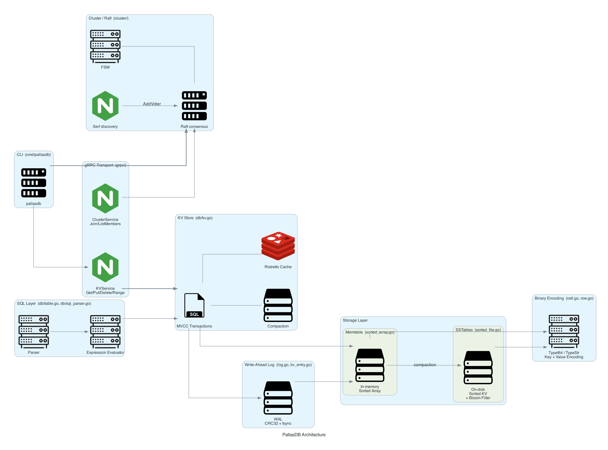
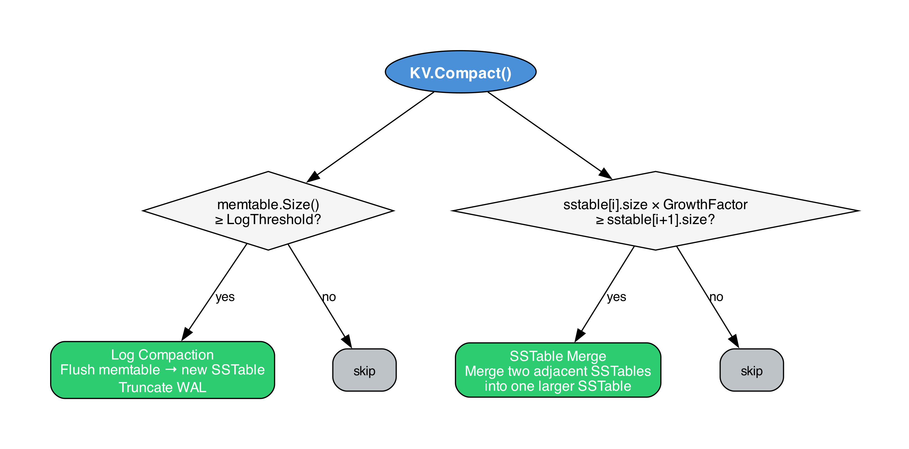
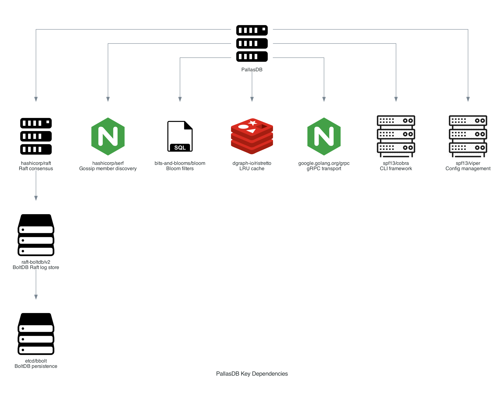

# Architecture Overview

PallasDB is structured as three independent layers that can be used separately or stacked together.

## Data flow - write path

1. **Client** calls `KV.Set(key, val)` (or via gRPC `Put`, or SQL `INSERT`).
2. A **transaction** (`KVTX`) is opened with a snapshot of the current state.
3. The mutation is staged in `tx.updates` (a `SortedArray`).
4. On `Commit()`:
   a. A **conflict check** compares updated keys against keys modified by concurrent transactions since this snapshot.
   b. Each mutation is appended to the **WAL** (`Log.Write`) as a `EntryAdd` or `EntryDel` record.
   c. A `EntryCommit` record is written and **fsync'd** - the write is now durable.
   d. The transaction's updates are merged into the in-memory **memtable** (`kv.mem`).
5. If **auto-compact** is enabled, a compaction signal is sent on `kv.updated`.

In **cluster mode**, mutating commands are first encoded as a `Command` protobuf, submitted to `raft.Apply`, and only reach the FSM's `Apply()` method after consensus. The FSM then calls `db.KV.SetEx` / `db.KV.Del` directly.

## Data flow - read path

1. `KV.Get(key)` checks the optional **Ristretto LRU cache** first.
2. A transaction is opened, creating a `MergedSortedKV` view spanning:
   - `tx.updates` (pending mutations, if any)
   - `kv.mem` (memtable snapshot)
   - `kv.main[0..n]` (SSTable snapshots, newest first)
3. The merged view performs `getExact(key)`:
   - For `SortedArray`: binary search on the in-memory key slice.
   - For `SortedFile`: bloom filter pre-check, then binary search using the on-disk offset index.
4. The first level that returns `found=true` wins; deleted markers suppress the result.
5. On cache miss the result is inserted into the Ristretto cache.

## Compaction

Compaction has two sub-operations that are triggered by `KV.Compact()`:

Both operations update the double-buffered **metadata** files atomically before closing old files.

## Key dependencies

