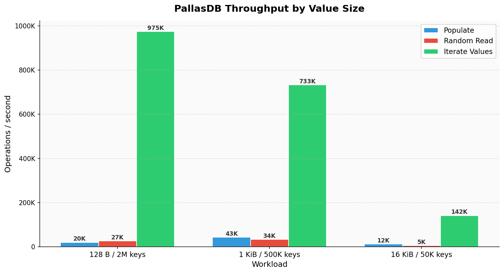
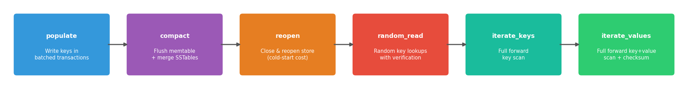
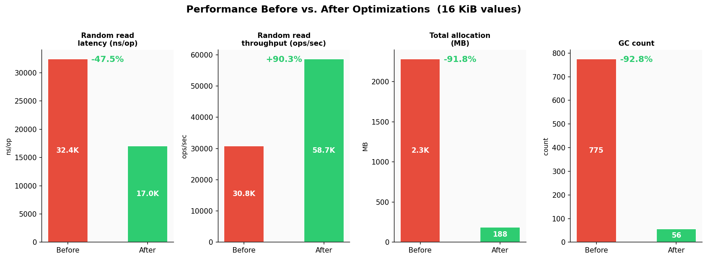

# Benchmarks

Recorded benchmark results from an Apple M4 MacBook Air (arm64, 10 cores, Go 1.26.3).

Source: `benchmarks/m4-macbook-air-results.txt`, `benchmarks/PallasDB-M4-Benchmark.md`, `benchmarks/performance-optimizations-2026-06-03.md`

---

## Summary results



All runs reported `missing: 0` and `errors: 0`.

---

## Benchmark phases

Each benchmark run executes the following sequential phases:



---

## Detailed results

### 128-byte values, 2 million keys

```
populate:      19,993 ops/sec  (1m40s total)
compact:       12.7s
reopen:        890 µs
random_read:   26,588 ops/sec  (18.8s for 500k reads)
iterate_keys:  1,014,357 ops/sec
iterate_values: 974,720 ops/sec
data_dir_size: 324,396,366 bytes (~309 MiB)
```

### 1 KiB values, 500k keys

```
populate:      43,362 ops/sec  (11.5s total)
compact:       5.6s
reopen:        425 µs
random_read:   33,529 ops/sec  (8.9s for 300k reads)
iterate_keys:  911,829 ops/sec
iterate_values: 732,912 ops/sec
data_dir_size: 529,099,166 bytes (~505 MiB)
```

### 16 KiB values, 50k keys

```
populate:      12,281 ops/sec  (4.1s total)
compact:       3.7s
reopen:        222 µs
random_read:   5,364 ops/sec   (18.6s for 100k reads)
iterate_keys:  322,315 ops/sec
iterate_values: 141,650 ops/sec
data_dir_size: 820,910,006 bytes (~783 MiB)
```

---

## Performance optimizations (2026-06-03)

Two optimizations were applied after the initial benchmark run, resulting in significant improvements for large-value workloads:

### 1. Binary search key-only reads

Previously, `compareKeyAt` read both key and value bytes during binary search. The fix reads only the key during comparison, fetching the value separately only after the binary search confirms a match.

### 2. Fast-path append for ordered writes

When a transaction's updates are ordered after all existing memtable keys and no concurrent transactions are open, the commit appends directly to the memtable slices instead of performing a full merge. This eliminates O(n) work for sequential-key batch inserts.

**Before vs. after (16 KiB values)**:



---

## Running benchmarks

### Smoke test (fast verification)

```sh
go run ./cmd/pallasdb local benchmark \
  --data-dir /tmp/smoke \
  --reset --keys 20000 --value-size 128 \
  --batch-size 500 --read-ops 20000 \
  --scan-limit 20000 --compact \
  --format text
```

### Full scaled benchmark

```sh
go run ./cmd/pallasdb local benchmark \
  --data-dir /tmp/bench-v128 \
  --reset --keys 2000000 --value-size 128 \
  --batch-size 1000 --read-ops 500000 \
  --compact --format text \
  --output benchmarks/results.txt
```

### Verifying the benchmark implementation

```sh
go test ./cmd/pallasdb -run 'TestLocalBenchmark'
go test ./db ./cmd/pallasdb
```

---

## Environment

All recorded results were produced on:

| Field | Value |
|---|---|
| Hardware | Apple M4 MacBook Air |
| OS | darwin/arm64 |
| Go version | go1.26.3 |
| GOMAXPROCS | 10 |
| CPUs | 10 |
