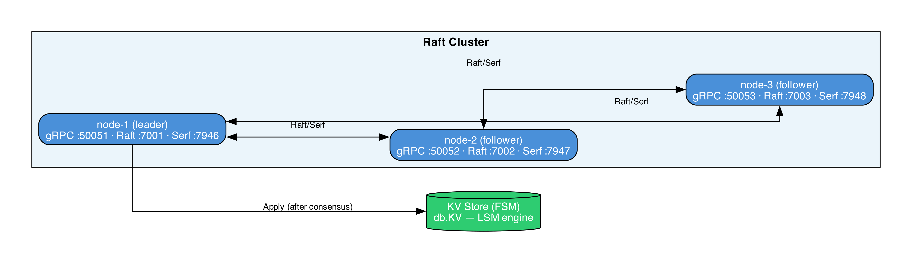

# Cluster & Raft

Source: `cluster/node.go`, `cluster/fsm.go`, `cluster/fsm_snapshot.go`, `cluster/command.go`, `cluster/discovery/serf.go`

PallasDB's cluster mode provides strongly-consistent replicated writes using the [HashiCorp Raft](https://github.com/hashicorp/raft) library. Member discovery uses [Serf](https://github.com/hashicorp/serf) gossip.

---

## Architecture



All mutating writes (Put, Delete) go through the Raft leader. Reads can be served locally from any node's FSM state (eventual consistency for reads, strong consistency for writes).

---

## Node lifecycle

### `cluster.Open(kvStore, cfg)`

1. Creates the Raft data directory (`cfg.RaftDir`).
2. Configures the Raft instance with `cfg.NodeID` as the local server ID.
3. Opens a TCP transport on `cfg.RaftAddr`.
4. Opens a BoltDB store at `cfg.RaftDir/raft.db` (with a 5-second file lock timeout to avoid blocking on a crashed predecessor).
5. Creates a file-based snapshot store (keeps 2 snapshots).
6. Creates the FSM wrapping `kvStore`.
7. Starts the `raft.Raft` instance.
8. If `cfg.Bootstrap=true`, bootstraps the cluster with this node as the sole voter.
9. If `cfg.SerfEnabled=true`, starts Serf and begins handling discovery events.
10. If `cfg.JoinAddr != ""`, sends a gRPC `Join` request to the existing cluster.

### `Node.Shutdown()`

1. Stops Serf (if enabled).
2. Shuts down the Raft instance.
3. Closes the TCP transport.
4. Closes the BoltDB store.

---

## Finite State Machine (FSM)

`FSM` implements `raft.FSM` and wraps `*db.KV` with a `sync.RWMutex` to allow atomic state replacement during `Restore`.

### `Apply(log *raft.Log) interface{}`

Called by Raft after a log entry is committed to a quorum. The entry is decoded as a `Command`:

```go
type Command struct {
    Op   OpType      // OpPut or OpDel
    Key  []byte
    Val  []byte
    Mode uint8       // maps to db.UpdateMode
}
```

- `OpPut` → `store.SetEx(key, val, mode)`
- `OpDel` → `store.Del(key)`

Returns `*FSMResult{Updated: bool, Err: error}`. The caller (cluster gRPC server) surfaces the error to the client.

### `Snapshot() (raft.FSMSnapshot, error)`

Calls `store.IterAll()` to get a consistent point-in-time iterator. The iterator and its cleanup function are passed to `FSMSnapshot`, which streams all key-value pairs to the snapshot sink.

### `Restore(rc io.ReadCloser) error`

Atomically replaces the entire FSM state:

1. Reads all `(key, val)` pairs from the snapshot stream.
2. Opens a fresh `db.KV` at a temp directory (`dirpath + ".restore"`).
3. Writes all pairs to the fresh store.
4. Under `f.mu.Lock()`:
   - Closes the existing store.
   - Removes the old data directory.
   - Renames the temp directory to `dirpath`.
   - Opens a new `db.KV` from `dirpath`.
5. The entire directory swap is the atomic unit.

---

## Serf discovery

`cluster/discovery/serf.go` wraps the Serf library for automatic peer discovery:

```go
type Config struct {
    NodeID            string
    GRPCAddr          string  // advertised in member metadata
    RaftAddr          string  // advertised in member metadata
    SerfAddr          string  // bind address
    SerfAdvertiseAddr string  // for NAT traversal
    JoinAddrs         []string
    EventBuffer       int
}
```

Each Serf member advertises its `NodeID`, `GRPCAddr`, and `RaftAddr` as member tags.

When a `EventMemberJoin` or `EventMemberUpdate` event is received and this node is the Raft leader, `Node.addDiscoveredVoter` calls `n.raft.AddVoter(member.NodeID, member.RaftAddr)`. This means new nodes can join a cluster automatically without knowing the leader's address - they only need to know any existing Serf member's address.

### `SerfDiscovery.Members()`

Returns `[]NodeInfo` with the current known members, their gRPC and Raft addresses, and their Serf status.

---

## Join via gRPC

When `cfg.JoinAddr` is set (and Serf is not handling join automatically), a gRPC `Join` request is sent to the target:

```go
client.Join(ctx, &pbv1.JoinRequest{NodeId: nodeID, RaftAddr: raftAddr})
```

The target calls `node.AddVoter(nodeID, raftAddr)` on the Raft leader. If the target is not the leader, the `Join` call will still work as long as the target can forward or the caller retries.

---

## Write path in cluster mode

The cluster gRPC server (`grpc/cluster_server.go`) intercepts Put and Delete:

1. Encodes the operation as a `Command`.
2. Calls `raft.Apply(encodedCommand, timeout)`.
3. Waits for the future to resolve (consensus reached and FSM applied on the leader).
4. Extracts `*FSMResult` from the future's response.
5. Returns the result to the caller.

If the node is not the leader, `raft.ErrNotLeader` is returned and the client should retry against the leader.

---

## Configuration reference

| Field | Default | Description |
|---|---|---|
| `NodeID` | required | Unique identifier for this node |
| `GRPCAddr` | required | gRPC listen address, advertised via Serf |
| `RaftAddr` | required | Raft TCP transport address |
| `RaftDir` | required | Directory for BoltDB and snapshots |
| `Bootstrap` | `false` | Bootstrap this node as the first in the cluster |
| `JoinAddr` | `""` | gRPC address of an existing node to join |
| `Timeout` | `10s` | Raft apply timeout |
| `SerfEnabled` | `true` | Start Serf gossip for automatic discovery |
| `SerfAddr` | `:7946` | Serf bind address |
| `SerfAdvertiseAddr` | `""` | Serf advertise address (NAT) |
| `SerfJoinAddrs` | `[]` | Serf addresses of existing members |
| `SerfEventBuffer` | `64` | Serf event channel capacity |
