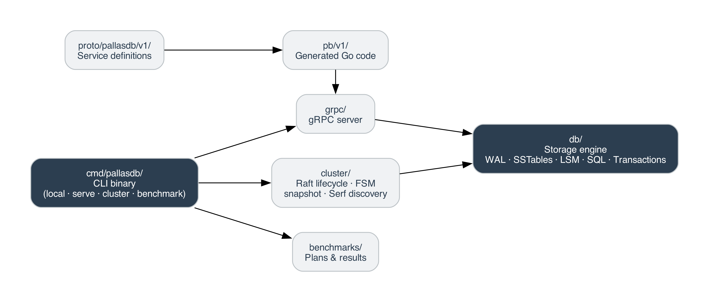

# PallasDB

PallasDB is a key-value database written in Go, built from first principles. It provides crash-safe persistence, sorted string tables, multi-level compaction, a SQL layer, gRPC transport, and Raft-backed replication.

## What it is

At its core PallasDB is an **LSM-tree storage engine** layered with:

- A **Write-Ahead Log** (WAL) for crash safety
- **SSTables** (Sorted String Tables) for durable sorted storage
- A **merge iterator** that unifies multiple sorted levels into a single view
- An **MVCC transaction** model with snapshot isolation and conflict detection
- A **recursive-descent SQL parser** and expression evaluator
- A **gRPC server** for remote key-value access
- A **Raft consensus layer** (via HashiCorp Raft) for replicated, strongly-consistent writes
- **Serf gossip** for automatic cluster member discovery

## Source layout

## Design goals

- **Crash-safe by default** - every committed write is fsync'd before returning.
- **Sorted access** - all structures (memtable, SSTables, merge iterators) maintain lexicographic order, enabling efficient range scans.
- **Strong consistency in cluster mode** - all mutating operations route through the Raft leader; reads can be served locally.
- **Self-contained binary** - a single `pallasdb` binary covers local embed, standalone gRPC server, and full Raft cluster node.
