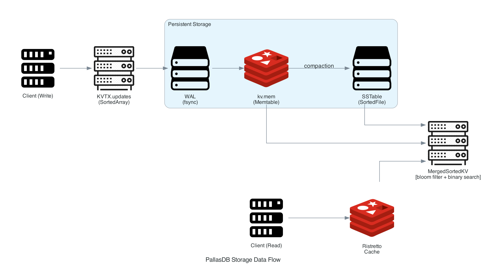

# Storage Engine

The storage engine lives entirely in `db/`. It is a classic **LSM-tree** (Log-Structured Merge-tree) with a custom binary encoding layer.

## Components at a glance

| Component | File(s) | Role |
|---|---|---|
| Binary encoding | `cell.go` | Typed value encoding for keys and values |
| Row/schema encoding | `row.go` | Multi-column key and value encoding |
| Write-Ahead Log | `log.go`, `kv_entry.go` | Crash-safe mutation log |
| Memtable | `sorted_array.go` | In-memory sorted key-value buffer |
| SSTables | `sorted_file.go` | Immutable on-disk sorted key-value files |
| Merge iterator | `merge.go` | Multi-level sorted merge |
| KV store | `kv.go` | LSM engine: transactions, compaction, cache |
| Metadata | `metadata.go` | Double-buffered SSTable version tracking |
| SQL layer | `sql_parser.go`, `eval.go`, `table.go` | SQL parsing, expression evaluation, table ops |

## On-disk layout

For a data directory `./data`, PallasDB creates:

SSTable filenames are `sstable_<version>` where `version` is a monotonically increasing `uint64` tracked in the metadata.

## Data flow summary

The sections below document each component in detail.
